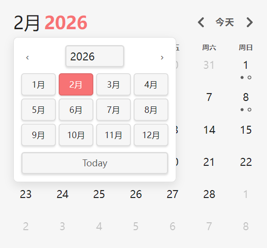

# obsidian-calendar-plugin

This is the React reimplementation of the [liamcain/obsidian-calendar-plugin](https://github.com/liamcain/obsidian-calendar-plugin): a simple calendar widget for Obsidian.

The refactor was largely done with [Cursor](https://cursor.com).

[中文](README_cn.md)

## Installation

1. Open this project’s [Releases](releases) page.
2. Download the latest `calendar-react.zip` from the release assets.
3. Unzip it and place the `calendar-react` folder into your vault’s plugin directory:  
   `<vault>/.obsidian/plugins/`
4. Enable **Calendar (React)** in Obsidian: Settings → Community plugins → Turn on.

## New Features

- **Quick date switch** — Click the month/year title (e.g. "Feb 2026") in the calendar header to open a picker: choose year and month, or jump to **Today**.

- **Performance** — Metadata for calendar cells is cached so repeated renders don’t refetch; file-change refresh is debounced; `DayCell` / `WeekNumCell` are memoized; redundant store updates are skipped when the active file hasn’t changed.

## Development (React + Vite + Bun)

- Install: `bun install`
- Build: `bun run build`

### Hot reload

1. You can create a `.env` file and specify the build output directory (e.g. `OUT_DIR=../TestPlugins/.obsidian/plugins/calendar-react`).
2. Install the [hot-reload](https://github.com/pjeby/hot-reload) plugin in Obsidian.
3. Run `bun run build` (or use watch mode if you add one). Hot-reload will pick up changes to the built files in your plugin directory.
